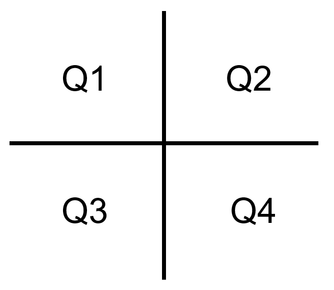

# Introduction  

This VIBE package can be used to easily visualize bulk RNA sequencing datasets for which log2 tpm/cpm values are pre-calculated. This package includes functions to generate tables with summary statistics (mean/median), per-gene boxplots, scatterplots for co-expression, and heatmaps.  

# Setup  

## Install VIBE package 

Install dependencies

```{r, eval=FALSE}
install.packages("git2r", "devtools")
```


Install the VIBE package from gitlab  

```{r, eval=FALSE}
devtools::install_git("https://datascience.genmab.net/gitlab/data-science-apps/vibe.git", 
                      credentials = git2r::cred_user_pass(rstudioapi::askForPassword("username"),
                                                          rstudioapi::askForPassword("Password")))
```
If you want to install the development version, add `ref = "dev"`. 

## Load libraries   

```{r load libraries, results='hide', message=FALSE, warning=FALSE}
library(vibe)
library(dplyr)
# set the dplyr options to prevent warning messages
options(dplyr.summarise.inform = FALSE)
```

## Load data  

The following dummy dataset was generated randomly and is **not based on any real-life data**! It can be used to test VIBE's functions.    

```{r load VIBE_example_data}
data(VIBE_data)

head(VIBE_data)

dataset_name = "VIBE dummydata"
```

# Workflow  

## Harmonize data  

### Dataframe harmonization to use VIBE functions on your dataset    

Each dataset has a slightly different naming convention. To ensure all columns are named as expected, please run the `harmonize_df()` function. It requires you to name several columns, of which some are optional. Each dataset should be in long (tidy) format and include at least the columns indication, gene symbol and value. The columns col_patientid, col_sampleid, col_treatment and col_therapy are optional, but should definitely be assigned if such columns are present in your dataset.  

input:

|col_name         | description contents                                        |obligatory?                                    |
|:---------------:|:----------------------------------------------------------- |:---------------------------------------------:|
|col_patientid    | unique identifiers for each patient/subject in your dataset |depends: each sample needs a unique identifier, this can be either assigned to patientid or sampleid. col_patientid must be present for paired pre/post treatment datasets. |
|col_sampleid     | unique identifiers for each sample in your dataset          | depends: see col_patientid                                            |
|col_indication   | indications, e.g. tumor types                               | yes                                           |
|col_treatment    | pre- or post-treatment samples. If present, must include "pre" and/or "post"| no, but necessary for pre/post plotting |
|col_symbol       | official gene symbols                                       | yes                                           |
|col_value        | column with normalized gene counts in log2 (e.g.in  tpm or cpm)    | yes                                           |
|unit             | unit in which your values are expressed (e.g. tpm or cpm)   | yes                                           |

The function outputs the renamed dataframe, with a new `intr` column (indication + treatment) as a factor. It includes all columns that are named by the function. If you want to keep additional columns add the column names as a vector to `keep_extra_cols`.

```{r harmonize dataframe}
df_harmonized = harmonize_df(df = VIBE_data, 
                             col_patientid = "patient_no", 
                             col_sampleid = "analysis", 
                             col_indication = "tumor", 
                             col_treatment = "treatment_flag", 
                             col_symbol = "gene", 
                             col_value = "log2_tpm", 
                             unit = "tpm", 
                             keep_extra_cols = c("database"))

```
Print any dataframe as a downloadable table in an HTML notebook using the `print_downloadable_df` function. In the following example only the first 20 rows are included as df_harmonized is already a relatively large dataset for this function to work.    

```{r }
print_downloadable_df(df_harmonized[1:20,])
```

It can happen that the dataset does not include a treatment column, in that case a `treatment` column with `NA` will be returned. The treatment column is necessary for some of VIBE's functions to work, however, these treatment NAs will not be visible in plot outputs.  

```{r harmonize dataframe no treatment}
harmonize_df(df = VIBE_data, 
                             col_patientid = "patient_no", 
                             col_sampleid = "analysis", 
                             col_indication = "tumor", 
                             col_symbol = "gene", 
                             col_value = "log2_tpm", 
                             unit = "tpm") %>% 
  head()
```

### Dataframe harmonization for pathway analysis    

In certain cases, instead of genes, pathways are of interest. In that case, the following function can be used to generate a data frame with values corresponding to pathways instead of genes. The data frame returned can be used as input for the VIBE functions.

```{r}
# Creating lists ----------
pathway_1 <- c("Gene 14","Gene 30","Gene 20","Gene 22","Gene 29","Gene 23","Gene 1","Gene 32","Gene 33")
pathway_2 <- c("Gene 21","Gene 11","Immune target","Gene 18","Gene 8","Gene 16")
pathway_3 <- c("Gene 2" ,"Gene 3" ,"Gene 5" ,"Gene 6","Gene 7","Gene 10","Gene 15","Gene 17","Gene 18","Gene 24","Gene 25","Gene 28","Gene 31","Gene 35")
pathway_4 <- c('Gene 19',"Gene 12","Gene 26")

immune_target <- "Immune target"
tumor_target <- "Tumor target"

gene_panel_list <- list( pathway_1,pathway_2,pathway_3,pathway_4, immune_target, tumor_target)
names(gene_panel_list) <- c("pathway_1", "pathway_2","pathway_3","pathway_4","immune_target","tumor_target")

# Calling function ----------------------------------------------------------------------
df_avg_pathways <- harmonize_df_pathway(df_harmonized, gene_panel_list)

```

## Summary stats  

### Mean/median expression  

Get sample numbers and median or mean values per gene for each unique indication/treatment combination in the dataset. The data can be grouped by assigning a different column name to `gouping_var`.

```{r}
get_expr_table(df_harmonized, 
               method = "median") %>% #can also be "mean"
  print_downloadable_df()
```

```{r}
get_expr_table(df_harmonized, 
               method = "median", #can also be "mean"
               grouping_var = "indication") %>% 
  print_downloadable_df()
```

### Percentage above threshold  

Print a table with the percentage of samples above the median or mean threshold for each indication/treatment combination: the "intr" group.  The data can be grouped by assigning a different column name to `gouping_var` as in the example above.  

```{r}
get_perc_gene(df_harmonized, 
              gene = tumor_target, 
              method = "median") %>% # can also be "mean"
    print_downloadable_df()
```

### Correlations  

Print a table with the spearman or pearson correlation for two target genes of interest.  

```{r}
get_correlation(df_harmonized,
                target1 = tumor_target, 
                target2 = immune_target, 
                cor_method = "spearman") %>%
  print_downloadable_df()
```

## Visualizing the data  

*NOTE: functions that calculate a threshold `plot_expression_box()`, `plot_expression_scatter()`, `plot_perc_pop()`, `heatmap_samples_above_median()`) have options to filter data within the function. This ensures that the threshold is calculated based on the entire dataset, while only a selection of the samples is plotted. Please refer to examples for each of these functions separately.*  

### Boxplot for one gene  

Visualize expression of one gene for all indications present in the dataset. Optionally it can be ordered by percentage of samples with above median/mean expression.  

```{r fig.width = 8, fig.height = 4}
plot_expression_box(df_harmonized, 
                    gene = tumor_target, 
                    method = "median", 
                    order = "T", 
                    dataset = dataset_name)

plot_expression_box(df_harmonized, 
                    gene = tumor_target, 
                    method = "median", 
                    order = "F", 
                    dataset = dataset_name)
```

`plot_expression_box()` will use the `intr` column as a grouping variable. Alternatively, you can  group by e.g. indication by setting the grouping_var  

```{r fig.width = 6, fig.height = 4}
plot_expression_box(df_harmonized, 
                    gene = immune_target, 
                    method = "median", 
                    order = "T", 
                    dataset = dataset_name, 
                    grouping_var = "indication")
```

To filter which groups will be plotted without changing the median threshold value, assign a vector with your groups of interest to the `plot_groups` variable. The filter option will check the `grouping_var` columns for these values.  

```{r fig.width = 4, fig.height = 4}
plot_expression_box(df_harmonized, 
                    gene = immune_target, 
                    method = "median", 
                    order = "T", 
                    dataset = dataset_name, 
                    grouping_var = "intr", 
                    plot_groups = c("NSCLC pre", "NSCLC post"))


plot_expression_box(df_harmonized, 
                    gene = immune_target, 
                    method = "median", 
                    order = "T", 
                    dataset = dataset_name, 
                    grouping_var = "indication", 
                    plot_groups = c("RCC", "NSCLC"))
```

### Split boxplot with fold change (unpaired data)  

To compare expression for one gene across two groups with unmatched data use `plot_expression_box_split`. The argument `grouping_var` controls which column is used to plot groups on the x-axis. The argument `splitting_var` controls which column is used to split the data into two groups per `grouping_var` variable. 

The function also calculates several statistics:

  * fold change (fc): split_groupB/split_groupA; or when `reverse=TRUE` split_groupA/split_groupB  
  * p-value calculated by kruskal wallis test
  * percentage of samples above the median or mean threshold per `splitting_var` variable

If a `grouping_var` variable is only present in one of the two groups, only that group is plotted. Fold change and p-value will not be calculated.
  
This function also has the option to only plot a selection of variables within the `grouping_var` column using `plot_groups`.

```{r fig.height = 4, fig.width = 6}
plot_expression_box_split(df = df_harmonized, 
                          gene = immune_target, 
                          threshold_method = "median", # can also be "mean"
                          dataset = dataset_name, 
                          grouping_var = "indication", # standard is "intr"
                          plot_groups = c("BRCA", "CERV", "CRC", "NSCLC", "RCC"), # can be left out to plot all groups
                          splitting_var = "database")
```

### Pre/post treatment expression (paired data)  

Plot paired pre- and post-treatment samples for selected genes. 

```{r fig.height = 18, fig.width = 14}
plot_box_pre_post(df_harmonized, 
                  dataset = dataset_name, 
                  symbol_list = c("Gene 1", "Gene 2", "Gene 3", "Gene 4", "Gene 5", "Gene 6"), 
                  method = "median")
```

### Scatterplot (two genes)  

Plot expression of two target genes with their correlation coefficient and p-value calculated using either spearman or pearson correlation methods. In addition, it calculates a threshold for each gene based on overall mean/median expression for that gene across all indications in the dataframe. These thresholds will show up as a quadrant on each plot. The percentage of samples within the selected quarter of interest (QOI) will be printed as well. There are four quadrants to choose from:  

{width=150px height=150px}
    
```{r fig.height = 10, fig.width = 9}
plot_expression_scatter(df = df_harmonized, 
                        target1 = tumor_target, 
                        target2 = immune_target, 
                        QOI = "Q2", 
                        cor_method = "spearman", 
                        threshold_method = "median", 
                        dataset = dataset_name)
```

You can change the number of facet columns by setting `facet_ncol` 

```{r fig.height = 10, fig.width = 8}
plot_expression_scatter(df = df_harmonized, 
                        target1 = tumor_target, 
                        target2 = immune_target, 
                        QOI = "Q2", 
                        cor_method = "spearman", 
                        threshold_method = "median", 
                        dataset = dataset_name, 
                        facet_ncol = 4)
```

You can change `grouping_var` to plot facets per indication (or another column)  

```{r  fig.height = 7, fig.width = 9}
plot_expression_scatter(df = df_harmonized, 
                        target1 = tumor_target, 
                        target2 = immune_target, 
                        QOI = "Q2", 
                        cor_method = "spearman", 
                        threshold_method = "median", 
                        dataset = dataset_name, 
                        grouping_var = "indication")
```

You can also choose to select which facets you would like to plot, while the thresholds are still calculated on the complete dataset

```{r fig.height = 3, fig.width = 6}
plot_expression_scatter(df = df_harmonized, 
                        target1 = tumor_target, 
                        target2 = immune_target, 
                        QOI = "Q2", 
                        cor_method = "spearman", 
                        threshold_method = "median", 
                        dataset = dataset_name, 
                        grouping_var = "intr", 
                        plot_groups = "NSCLC")


plot_expression_scatter(df = df_harmonized, 
                        target1 = tumor_target, 
                        target2 = immune_target, 
                        QOI = "Q2", 
                        cor_method = "spearman", 
                        threshold_method = "median", 
                        dataset = dataset_name, 
                        grouping_var = "indication", 
                        plot_groups = c("NSCLC", "TNBC"))
```

### Scatterplot (three genes)  

The same function for plotting two genes can be used to color dots based on expression of a third gene. Please check previous section the "Scatterplot (two genes)" for more examples of additional options.   

```{r fig.height = 10, fig.width = 9}
plot_expression_scatter(df = df_harmonized, 
                        target1 = immune_target, 
                        target2 = tumor_target, 
                        target3 = "Gene 3", 
                        QOI = "Q2", 
                        cor_method = "spearman", 
                        threshold_method = "median", 
                        dataset = dataset_name)
```

### Percentage in quadrant of interest barplot  

The percentage of samples that fall within the quadrant of interest (QOI) of the scatterplot (see the Scatterplot section for more information) are plotted. The threshold is calculated across all indications in the dataframe, but for each target gene separately. Ordering based on the percentage of patients is optional.    

```{r fig.width = 8, fig.height = 4}
plot_perc_pop(df = df_harmonized, 
              target1 = tumor_target, 
              target2 = immune_target, 
              threshold_method = "median", 
              QOI = "Q2", 
              order = "T", 
              dataset = dataset_name)

plot_perc_pop(df = df_harmonized, 
              target1 = tumor_target, 
              target2 = immune_target, 
              threshold_method = "median", 
              QOI = "Q1", 
              order = "F", 
              dataset = dataset_name)
```

You can adjust the `grouping_var` to a different column name such as `"indication"`.

```{r fig.width = 6, fig.height = 4}
plot_perc_pop(df = df_harmonized, 
              target1 = tumor_target, 
              target2 = immune_target, 
              threshold_method = "median", 
              QOI = "Q2", 
              order = "T", 
              dataset = dataset_name, 
              grouping_var = "indication")

```

To filter which groups will be plotted without changing the median threshold value, assign a vector with your groups of interest to the `plot_groups` variable. The filter option will check the `grouping_var` columns for these values.  

```{r fig.width = 6, fig.height = 4}
plot_perc_pop(df = df_harmonized, 
              target1 = tumor_target, 
              target2 = immune_target, 
              threshold_method = "median", 
              QOI = "Q1", 
              order = "T", 
              dataset = dataset_name, 
              plot_groups = "NSCLC")

plot_perc_pop(df = df_harmonized, 
              target1 = tumor_target, 
              target2 = immune_target, 
              threshold_method = "median", 
              QOI = "Q1", 
              order = "T", 
              dataset = dataset_name, 
              grouping_var = "indication", 
              plot_groups = c("NSCLC", "RCC"))
```

To plot variables using two columns use the function `plot_perc_pop_split`. It has the same functionality as the function above but it allows you to use an additional variable for coloring and labeling the bars.

```{r fig.width= 8, fig.height = 4}
plot_perc_pop_split(df = df_harmonized, target1 = "Immune target", target2 = "Tumor target", threshold_method = "median", QOI = "Q2", order = "T",
                                     dataset = "Dataset", grouping_var = "indication", splitting_var = "database") 
```


### Heatmap expression levels    

Heatmap of median or mean expression for each indication or selected grouping variable, scaled per gene. It can optionally not be scaled (scale=FALSE).  

```{r fig.width=8, fig.height = 6}
heatmap_sample_expression(df_harmonized, 
                          method = "mean", 
                          grouping_var="intr")
```

```{r fig.width=4, fig.height = 8}
rowsplit <-rep(c("Group1", "Group2","Group3", "Group4","IT","TT"), c(9,8,9,7,1,1))
heatmap_sample_expression(df_harmonized, method="median", grouping_var="intr", cluster_switch=rowsplit, plot_groups = c("NSCLC","RCC"))
```
```{r fig.width=8, fig.height = 8}
reorder_list <- c("Gene 14","Gene 30","Gene 20","Gene 22","Gene 29","Gene 23","Gene 1","Gene 32","Gene 33","Gene 21","Gene 11","Gene 18","Gene 8","Gene 16","Gene 2" ,"Gene 3" ,"Gene 5" ,"Gene 6","Gene 7","Gene 10","Gene 15","Gene 17","Gene 24","Gene 25","Gene 28","Gene 31","Gene 35",'Gene 19',"Gene 12","Gene 26","Gene 4","Gene 9","Immune target","Tumor target")

rowsplit_new <-rep(c("Pathway1", "Pathway2","Pathway3", "Pathway4","G4","G9","IT","TT"), c(9,5,13,3,1,1,1,1))
heatmap_sample_expression(df_harmonized, method="median", cluster_switch=rowsplit_new, order_4_heatmap = reorder_list)

```


### Heatmap Percentage of samples above median/mean expression   

Heatmap of the percentage of samples above median or mean expression for each indication or selected grouping variable.

```{r  fig.width=12, fig.height = 8}
heatmap_samples_above_median(df_harmonized, method = "median", cluster_switch = rowsplit)
```

You can change the grouping variable to e.g. `"indication"`:

```{r  fig.width=8, fig.height = 8}
heatmap_samples_above_median(df_harmonized, method = "median", cluster_switch = rowsplit, grouping_var = "indication")
```

You can select which groups are shown on the heatmap, while the thresholds are still calculated on all groups in the dataframe:

```{r fig.width=4, fig.height = 8}
heatmap_samples_above_median(df_harmonized, method = "median", cluster_switch = rowsplit, grouping_var = "intr", plot_groups = c("RCC", "TNBC"))
```
### Calculate Composite scores   

A table with composite scores for each indication or selected grouping variable.The table can be obtained for any quadrant of interest or for all quadrants. Furthermore, one can filter the rows based on the composite scores.

```{r  fig.width=12, fig.height = 8}
target1 <- "Immune target"
target2_list <- c("Gene 1","Gene 2","Gene 3","Gene 4","Gene 5","Gene 6","Gene 7","Gene 8","Gene 9","Gene 10")

get_composite_scores(df_harmonized, target1, target2_list,
                                 QOI = "Q2",
                                 threshold_method = "median",
                                 grouping_var="intr",
                                 filter_threshold = 30)  %>%
  print_downloadable_df()
```


### Heatmap Composite scores   

A heatmap with composite scores for each indication or selected grouping variable. The rows in the heatmap can be ordered based on one gene e.g. as shown here with "Gene 9". Filtering of the rows is indeed possible similar to get_composite_Score function.

```{r  fig.width=8, fig.height = 6}

heatmap_composite_scores(df_harmonized, target1, target2_list,
                                      QOI = "Q2",
                                      threshold_method = "median",
                                      grouping_var="intr",
                                      filter_threshold = 30, reverse=T, order_gene = "Gene.9")
```

